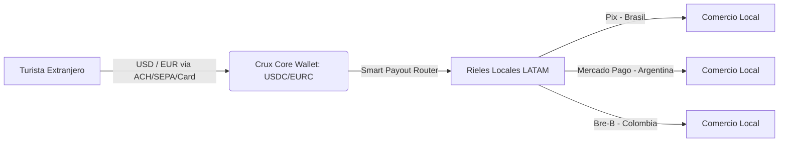
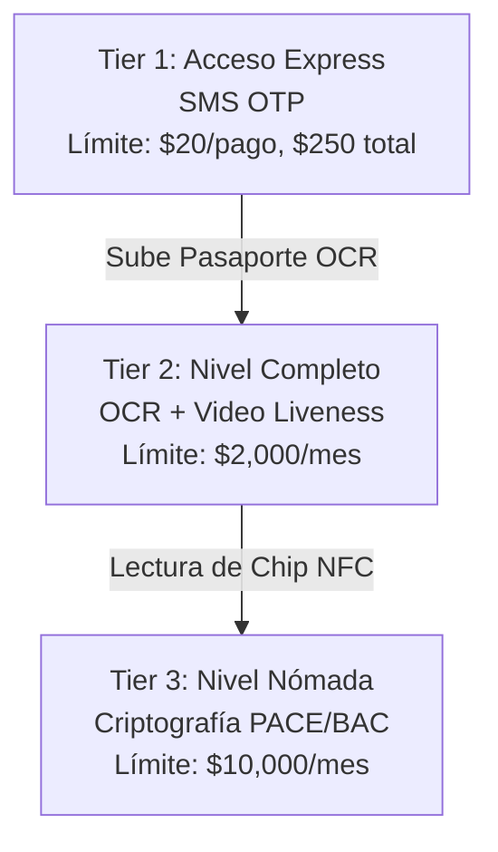

# Crux Fundamentals: Whitepaper Estratégico, Técnico y Regulatorio

Este documento sirve como especificación maestra de negocio, arquitectura e idoneidad regulatoria para **Crux**, una billetera de viaje unificada (Traveler OS) basada en stablecoins, diseñada específicamente para optimizar las transacciones de turistas y nómadas digitales en América Latina (con enfoque inicial en Brasil, Argentina, Colombia y Perú).

---

## 1. Resumen Ejecutivo y Propuesta de Valor

### El Problema en América Latina
El ecosistema de pagos de América Latina está profundamente fragmentado y penaliza financieramente al viajero internacional. Los principales dolores son:
1.  **Altos Costos de Intercambio y Conversión (FX)**: Las tarjetas occidentales tradicionales imponen tarifas del 1.5% al 3% de margen transfronterizo, más costos de Conversión de Moneda Dinámica (DCC).
2.  **Rechazo y Exclusión Digital**: Los comercios informales y rurales no aceptan tarjetas internacionales. A la vez, los turistas están excluidos de las redes nacionales de pago rápido (Pix en Brasil, Mercado Pago en Argentina, Bre-B en Colombia) por no tener documentos nacionales (CPF, CUIT) ni cuentas bancarias locales.
3.  **Inseguridad del Efectivo**: Obligados por el rechazo de tarjetas, los turistas retiran efectivo en cajeros locales soportando altas tarifas fijas ($5 a $10 USD por extracción) y riesgos físicos de robo.

### La Solución Crux
Crux funciona como un **Traveler OS** intermedio que absorbe la complejidad cambiaria mediante contratos inteligentes de stablecoins y APIs de orquestación, exponiendo una interfaz sencilla que liquida transacciones directamente en los códigos QR locales de los bancos centrales de la región.



---

## 2. Estrategia de Rentabilidad y Unit Economics

Crux adapta la estrategia comercial del duopolio chino Alipay/WeChat Pay utilizando la eficiencia operativa de blockchain y rieles de liquidación locales de alta eficiencia.

### Estructura de Comisiones (Hybrid Pricing & Spread Strategy)

1.  **Carga de Saldo (Inbound/Fondeo)**:
    *   **ACH, SEPA y depósitos de USDC nativo**: **1.0%** de comisión.
    *   **Tarjetas de Crédito/Débito (Stripe)**: **3.0%** de comisión (para cubrir los costos de adquirencia de Stripe y mitigar contracargos).
    *   **Apple Pay / Google Pay**: **2.0%** de comisión (subsidio estratégico del costo real menos 0.5% para incentivar la adopción móvil).
2.  **Pagos QR (Spread Cambiario Uniforme)**:
    *   Se aplica un **spread cambiario de 1.5% + $0.10 USDc** a todas las transacciones de checkout (eliminando la distinción o subsidio en micropagos para simplificar el modelo y consolidar la rentabilidad).
    *   Tanto las comisiones de servicio como las de red asociadas se muestran ocultas (fijadas en 0.00 en la interfaz del usuario), integrando el spread de manera invisible en el tipo de cambio cotizado.
3.  **Reembolsos / Retiros**:
    *   **0.5%** de comisión de salida al reembolsar saldo no utilizado de vuelta a la tarjeta del usuario.
4.  **Marketplace Turístico ("Mejora tu Viaje")**:
    *   Comisión cobrada a proveedores: **10%** en promedio.
    *   Beneficio al usuario: **5% de Cashback** diferido (se le cobra el 100% y se deposita el 5% de reembolso automático exactamente **1 minuto** después en su billetera). Esto fomenta la fidelización del usuario mientras Crux retiene un 5% de margen neto limpio.

### Simulación de Rentabilidad (Estancia de 10 días en Brasil)
Para un gasto promedio de $175 USD diarios (Total del viaje: $1,750 USD) compuesto por 50% fondeo ACH y 50% fondeo Tarjeta, y un consumo de 93 transacciones de pago QR (por ejemplo, 80 compras pequeñas y 13 medianas/grandes), más $215 USD de compras en el Marketplace:

| Módulo Transaccional | Volumen | Comisión / Spread | Ingreso Bruto | Costo / COGS | Margen Neto |
| :--- | :--- | :--- | :--- | :--- | :--- |
| **Fondeo (ACH/SEPA/USDC)** | $875.00 USDc | 1.0% | $8.75 USDc | $2.63 USDc (Bridge 0.3%) | $6.12 USDc |
| **Fondeo (Tarjeta Stripe)** | $875.00 USDc | 3.0% | $26.25 USDc | $21.88 USDc (Stripe 2.5%) | $4.37 USDc |
| **Pagos QR (Spread Cambiario)** | $1,535.00 USDc | 1.5% + $0.10 | $32.33 USDc | $4.65 USDc (93 tx × $0.05) | $27.68 USDc |
| **Marketplace (Tours/Seguros)**| $215.00 USDc | 10.0% (Partner Fee) | $21.50 USDc | $10.75 USDc (5% Cashback) | $10.75 USDc |
| **Consolidado** | **$3,500.00 USDc**| **2.54% Promedio** | **$88.83 USDc** | **$39.91 USDc** | **$48.92 USDc** |

> [!TIP]
> **Rentabilidad del Modelo**: Esta estructura unificada rinde un **margen de utilidad del 55.1%** sobre ingresos y captura un **take rate neto de 2.80%** sobre el volumen total de fondeo ($1,750 USD), garantizando la viabilidad financiera a largo plazo de la plataforma y mejorando sustancialmente los unit economics del proyecto sin añadir cargos visibles que generen fricción en el usuario.

---

## 3. Cumplimiento Normativo: Prevención de Lavado de Dinero (AML) y KYC

Para mitigar riesgos delictivos y cumplir con las regulaciones de la Red de Control de Delitos Financieros (FinCEN) y el Grupo de Acción Financiera Internacional (GAFI), Crux implementa un flujo de identificación de cliente (KYC) progresivo y escalonado por niveles.



### Arquitectura Técnico de los Niveles de Verificación

#### Tier 1: Acceso Express (Prevención de lavado de baja escala)
*   **Identificación**: Número de teléfono internacional + validación del dispositivo.
*   **Restricciones de AML**: Prohibido el marketplace de compras grandes, prohibido el envío de dinero P2P. Cuenta rígidamente confinada a compras P2M (Peer-to-Merchant) cotidianas de bajo valor.

#### Tier 2: Nivel Completo (eKYC Turista)
*   **Identificación**: Escaneo OCR de alta resolución del pasaporte nacional, extrayendo los datos de la Zona de Lectura Mecánica (MRZ).
*   **Prueba de Vida (Liveness Check)**: Captura de video facial analizada en tiempo real mediante algoritmos de biometría activa contra suplantaciones y deepfakes generados por Inteligencia Artificial (ZOLOZ Deeper / Sumsub).
*   **AML Screening**: Contraste automatizado de datos del pasaporte con listas internacionales de sanciones (OFAC, ONU) y Personas Expuestas Políticamente (PEP).

#### Tier 3: Nivel Nómada (Criptografía eIDV)
*   **Identificación**: Lectura de chips NFC de pasaportes biométricos electrónicos (ePassports) que cumplen con el estándar **OACI/ICAO 9303**.
*   **Protocolo de Seguridad**:
    1.  **BAC (Basic Access Control)** y **PACE (Password Authenticated Connection Establishment)** para generar canales seguros y evitar la lectura inalámbrica maliciosa (skimming).
    2.  **Autenticación Pasiva (PA)** para verificar la firma digital del chip contra las claves de las autoridades de certificación de los países emisores (CSCA). Esto ofrece protección absoluta contra falsificaciones de documentos físicos.

---

## 4. Políticas de Protección de Datos y Tokenización

Crux asume la protección de datos personales como un pilar arquitectónico no negociable, cumpliendo de forma nativa con el **RGPD / GDPR** de la Unión Europea, la **LGPD** de Brasil y la Ley 25.326 de Argentina.

### Privacidad y Almacenamiento
*   **Tokenización de Tarjetas**: Toda vinculación de tarjetas internacionales de crédito/débito utiliza tokenización de red (Visa Token Service / Mastercard Digital Enablement Service). Crux **nunca almacena** el número de tarjeta principal (PAN) ni el código de seguridad CVV en texto plano en sus servidores. Toda la interacción cumple de manera estricta con las normativas **PCI-DSS**.
*   **Cifrado de Datos**: Todos los documentos de identidad (OCR) e imágenes faciales se cifran utilizando el estándar **AES-256** en reposo, y viajan a través de canales encriptados mediante **TLS 1.3** en tránsito.
*   **Soberanía de Datos**: Se habilitan mecanismos sencillos de "derecho al olvido" para que el turista, al terminar su viaje, solicite la purga completa de sus datos biométricos de los servidores activos de Crux una vez vencido el plazo legal requerido para auditorías de AML (típicamente 5 años).

---

## 5. Arquitectura Técnico de Integración "Bajo el Capó"

Para proveer una experiencia nativa sin fricción, Crux integra componentes líderes en infraestructura financiera tradicional y descentralizada:

```
[ Capa de Aplicación - Crux App (React Native/WebView) ]
                       |
                       v
[ API Gateway / Capa de Seguridad (TLS 1.3, Firmas RSA-SHA256) ]
    /                  |                   \
   v                   v                    v
[Bridge.xyz API]  [Sumsub/ZOLOZ SDK]  [Local Liquidity Engines]
(Inbound ACH/SEPA) (eKYC / NFC PACE)  (Pix, MP, Bre-B, Transfiya)
```

### Componentes Clave:
1.  **Bridge.xyz (Stripe Platform)**: Utilizado para la orquestación y fondeo de entrada (*Inbound*). Recibe dólares y euros de transferencias bancarias de bajo costo (ACH en EE. UU., SEPA en Europa) y acuña/liquida stablecoins (USDC) en las redes de bajo coste Layer 2 (Base) o Solana.
2.  **Motor de Payout Local (Local Off-Ramps)**: Integración con procesadores locales B2B para transformar los tokens USDC del backend de Crux en moneda fiat local instantánea (Reales, Pesos argentinos o colombianos) depositada directamente en el código QR del comercio al momento de escanear.
3.  **Fact + Action Overlay (Separación de Orquestación y Pago)**: Al igual que en los mini-programas chinos, cuando el marketplace de Crux vende un servicio (ej. Seguro Chubb, eSIM regional o Tour de Civitatis), el proveedor tercero jamás accede a las llaves criptográficas ni datos financieros del usuario. La app de Crux superpone una ventana modal nativa de pago, procesando la liquidación en segundo plano de manera atómica.

---

## 6. Arquitectura Legal: Modelo de Patrocinio Regulatorio (License-Light)

Para operar desde el día uno con velocidad y minimizar los costos de cumplimiento, Crux no actúa como una entidad financiera autorizada de forma directa. En su lugar, Crux se estructura como un **Proveedor de Servicios Tecnológicos (Technology Service Provider - TSP)** que delega la custodia, transmisión de dinero y liquidación en socios regulados a través de APIs.

### 1. Rieles de Fondeo / Captación (EE. UU. y Europa)
Crux no capta ni custodia fondos fíat directamente. Delega esta responsabilidad en **Bridge.xyz** (que opera como transmisor de dinero registrado y socio de Stripe) y procesadores adquirentes asociados (Stripe).
*   **Rol de Crux**: Interfaz de usuario (front-end) y enrutador de datos.
*   **Rol del Socio Regulado**: Bridge.xyz recibe las transferencias (ACH/SEPA/Wire), procesa el pago con tarjeta, y realiza la acuñación y custodia de los dólares digitales (USDC). El flujo legal y los términos de servicio establecen que el usuario abre una cuenta administrada (*Managed Account*) bajo la licencia del socio regulado.

### 2. Rieles de Liquidación Local (LATAM Outbound)
Crux no ejecuta liquidaciones cambiarias ni transferencias fíat locales de forma directa. Se integra con motores de liquidez y orquestadores locales (*BaaS* y *Off-Ramp Partners*):
*   **Brasil (Pix)**: En lugar de registrarse ante el BCB, Crux opera mediante una **Institución de Pago asociada (IP/ITP)** o un proveedor de Banking-as-a-Service (p. ej., Fitbank, Dock o Bitso Brasil). El socio procesa la conversión final de USDC a Reales y liquida la transacción en el sistema Pix.
*   **Argentina (Mercado Pago / MODO)**: Crux no se registra como Proveedor de Servicios de Pago (PSP) ante el BCRA. Los rieles de entrada y salida local (CVU/CBU) y la conversión cambiaria se delegan en un socio PSP liquidante registrado (p. ej., Bitso Argentina o Pomelo).
*   **Colombia (Bre-B / Transfiya)**: Crux se apoya en una entidad financiera local autorizada (SEDPE o banco comercial) que tiene acceso directo a la cámara de compensación y ejecuta el payout local en Pesos Colombianos.

### 3. Obligaciones y Responsabilidades Tecnológicas de Crux
Aunque Crux no requiere licencias financieras directas, sí debe cumplir con estándares y auditorías de seguridad:
*   **Cumplimiento PCI-DSS**: Para transferir tokens de tarjetas de forma segura sin tocar datos bancarios críticos en texto plano.
*   **Enrutamiento eKYC / AML**: Crux actúa como el canalizador del proceso eKYC, pero la validación final y la inclusión en listas negras/sanciones corre por cuenta de los socios financieros regulados (como Bridge.xyz), quienes aprueban la cuenta según sus políticas de cumplimiento.
