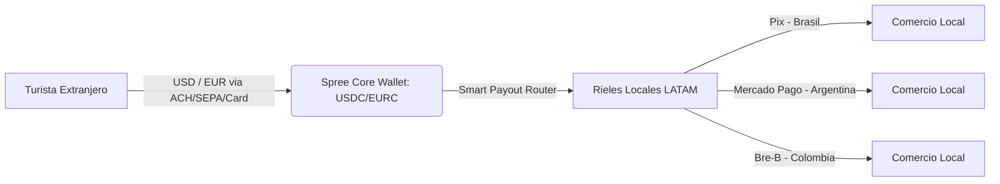
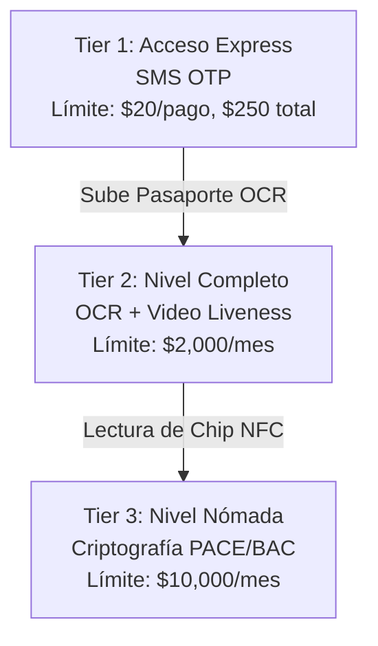

# Spree Fundamentals: Whitepaper Estratégico, Técnico y Regulatorio

Este documento sirve como especificación maestra de negocio, arquitectura e idoneidad regulatoria para **Spree**, una billetera de viaje unificada (Traveler OS) basada en stablecoins, diseñada específicamente para optimizar las transacciones de turistas y nómadas digitales en América Latina (con enfoque inicial en Brasil, Argentina, Colombia y Perú).

---

## 1. Resumen Ejecutivo y Propuesta de Valor

### El Problema en América Latina
El ecosistema de pagos de América Latina está profundamente fragmentado y penaliza financieramente al viajero internacional. Los principales dolores son:
1.  **Altos Costos de Intercambio y Conversión (FX)**: Las tarjetas occidentales tradicionales imponen tarifas del 1.5% al 3% de margen transfronterizo, más costos de Conversión de Moneda Dinámica (DCC).
2.  **Rechazo y Exclusión Digital**: Los comercios informales y rurales no aceptan tarjetas internacionales. A la vez, los turistas están excluidos de las redes nacionales de pago rápido (Pix en Brasil, Mercado Pago en Argentina, Bre-B en Colombia) por no tener documentos nacionales (CPF, CUIT) ni cuentas bancarias locales.
3.  **Inseguridad del Efectivo**: Obligados por el rechazo de tarjetas, los turistas retiran efectivo en cajeros locales soportando altas tarifas fijas ($5 a $10 USD por extracción) y riesgos físicos de robo.

### La Solución Spree
Spree funciona como un **Traveler OS** intermedio que absorbe la complejidad cambiaria mediante contratos inteligentes de stablecoins y APIs de orquestación, exponiendo una interfaz sencilla que liquida transacciones directamente en los códigos QR locales de los bancos centrales de la región.



---

## 2. Estrategia de Rentabilidad y Unit Economics

Spree adapta la estrategia comercial del duopolio chino Alipay/WeChat Pay (**The Waiver Rule**) utilizando la eficiencia operativa de blockchain.

### Política de Comisiones (Hybrid Pricing Strategy)
*   **Micropagos (≤ $15 USDc)**: **0% de comisión**. Financiado enteramente por la eficiencia del backend y como herramienta de atracción de usuarios (*loss-leader*).
*   **Macropagos (> $15 USDc)**: **3.0% de comisión**. Margen de captura aplicado sobre alojamientos, cenas, tours y alquiler de autos.

### Simulación de Rentabilidad (Estancia de 10 días en Brasil)
Para un gasto promedio de $175 USD diarios (Total del viaje: $1,750 USD) compuesto por 8 micropagos diarios de $7 USDc y 1.5 macropagos diarios de $79.33 USDc:

| Módulo Transaccional | Volumen | Fee Spree | Ingreso Bruto | Costo de Red/Riel (COGS) | Margen Neto |
| :--- | :--- | :--- | :--- | :--- | :--- |
| **Inbound (ACH/SEPA)** | $1,750.00 USDc | - | - | $5.25 USDc (Bridge 0.3%) | -$5.25 USDc |
| **Micropagos (≤ $15)** | $560.00 USDc | 0% | $0.00 USDc | $4.00 USDc (80 tx × $0.05) | -$4.00 USDc |
| **Macropagos (> $15)** | $1,190.00 USDc | 3.0% | $35.70 USDc | $0.75 USDc (15 tx × $0.05) | $34.95 USDc |
| **Consolidado** | **$1,750.00 USDc** | **2.04% Promedio** | **$35.70 USDc** | **$10.00 USDc** | **$25.70 USDc** |

> [!TIP]
> **Rentabilidad del Modelo**: Esta estructura rinde un **margen bruto de utilidad del 71.9%** sobre ingresos y captura un **take rate neto de 1.47%** sobre el volumen total transaccionado, demostrando que subsidiar micropagos es una estrategia altamente sostenible.

---

## 3. Cumplimiento Normativo: Prevención de Lavado de Dinero (AML) y KYC

Para mitigar riesgos delictivos y cumplir con las regulaciones de la Red de Control de Delitos Financieros (FinCEN) y el Grupo de Acción Financiera Internacional (GAFI), Spree implementa un flujo de identificación de cliente (KYC) progresivo y escalonado por niveles.



### Arquitectura Técnica de los Niveles de Verificación

#### Tier 1: Acceso Express (Prevención de lavado de baja escala)
*   **Identificación**: Número de teléfono internacional + validación del dispositivo.
*   **Restricciones de AML**: Prohibido el marketplace de compras grandes, prohibido el envío de dinero P2P. Cuenta rígidamente confinada a compras P2M (Peer-to-Merchant) cotidianas.

#### Tier 2: Nivel Completo (eKYC Turista)
*   **Identificación**: Escaneo OCR de alta resolución del pasaporte nacional, extrayendo los datos de la Zona de Lectura Mecánica (MRZ).
*   **Prueba de Vida (Liveness Check)**: Captura de video facial analizada en tiempo real mediante algoritmos de biometría activa contra suplantaciones y deepfakes generados por Inteligencia Artificial (ZOLOZ Deeper / Sumsub).
*   **AML Screening**: Contraste automatizado de datos del pasaporte con listas internacionales de sanciones (OFAC, ONU) y Personas Expuestas Políticamente (PEP).

#### Tier 3: Nivel Nómada (Criptografía eIDV)
*   **Identificación**: Lectura de chips NFC de pasaportes biométricos electrónicos (ePassports) que cumplen con el estándar **OACI/ICAO 9303**.
*   **Protocolo de Seguridad**:
    1.  **BAC (Basic Access Control)** y **PACE (Password Authenticated Connection Establishment)** para generar canales seguros y evitar la lectura inalámbrica maliciosa (skimming).
    2.  **Autenticación Pasiva (PA)** para verificar la firma digital del chip contra las claves de las autoridades de certificación de los países emisores (CSCA). Esto ofrece protección absoluta contra falsificaciones de documentos físicos.

---

## 4. Políticas de Protección de Datos y Tokenización

Spree asume la protección de datos personales como un pilar arquitectónico no negociable, cumpliendo de forma nativa con el **RGPD / GDPR** de la Unión Europea, la **LGPD** de Brasil y la Ley 25.326 de Argentina.

### Privacidad y Almacenamiento
*   **Tokenización de Tarjetas**: Toda vinculación de tarjetas internacionales de crédito/débito utiliza tokenización de red (Visa Token Service / Mastercard Digital Enablement Service). Spree **nunca almacena** el número de tarjeta principal (PAN) ni el código de seguridad CVV en texto plano en sus servidores. Toda la interacción cumple de manera estricta con las normativas **PCI-DSS**.
*   **Cifrado de Datos**: Todos los documentos de identidad (OCR) e imágenes faciales se cifran utilizando el estándar **AES-256** en reposo, y viajan a través de canales encriptados mediante **TLS 1.3** en tránsito.
*   **Soberanía de Datos**: Se habilitan mecanismos sencillos de "derecho al olvido" para que el turista, al terminar su viaje, solicite la purga completa de sus datos biométricos de los servidores activos de Spree una vez vencido el plazo legal requerido para auditorías de AML (típicamente 5 años).

---

## 5. Arquitectura Técnica de Integración "Bajo el Capó"

Para proveer una experiencia nativa sin fricción, Spree integra componentes líderes en infraestructura financiera tradicional y descentralizada:

```
[ Capa de Aplicación - Spree App (React Native/WebView) ]
                       |
                       v
[ API Gateway / Capa de Seguridad (TLS 1.3, Firmas RSA-SHA256) ]
    /                  |                   \
   v                   v                    v
[Bridge.xyz API]  [Sumsub/ZOLOZ SDK]  [Local Liquidity Engines]
(Inbound ACH/SEPA) (eKYC / NFC PACE)  (Pix, MP, Bre-B, Transfiya)
```

### Componentes Clave:
1.  **Bridge.xyz (Stripe Platform)**: Utilizado para la orquestación y fondeo de entrada (*Inbound*). Recibe dólares y euros de transferencias bancarias de bajo costo (ACH en EE. UU., SEPA en Europa) y acuña/liquida stablecoins (USDC) en las redes de bajo coste Layer 2 (Base) o Solana.
2.  **Motor de Payout Local (Local Off-Ramps)**: Integración con procesadores locales B2B para transformar los tokens USDC del backend de Spree en moneda fiat local instantánea (Reales, Pesos argentinos o colombianos) depositada directamente en el código QR del comercio al momento de escanear.
3.  **Fact + Action Overlay (Separación de Orquestación y Pago)**: Al igual que en los mini-programas chinos, cuando el marketplace de Spree vende un servicio (ej. Seguro Chubb, eSIM regional o Tour de Civitatis), el proveedor tercero jamás accede a las llaves criptográficas ni datos financieros del usuario. La app de Spree superpone una ventana modal nativa de pago, procesando la liquidación en segundo plano de manera atómica.

---

## 6. Marco Regulatorio y Licencias Requeridas

Para operar legalmente como una plataforma de pagos transfronteriza, Spree requiere estructurar un esquema híbrido de licencias:

### En los Mercados de Fondeo (EE. UU. y Europa)
1.  **Registro MSB (Money Services Business)** ante la FinCEN en los Estados Unidos.
2.  **Licencias de Transmisor de Dinero (MTL)** en los estados donde se capten fondos directamente, o en su defecto, operar mediante convenios de marca blanca con socios regulados (*Authorized Delegate*) como Bridge.xyz / Stripe.

### En los Mercados de Destino (LATAM)
1.  **Brasil**: Registrarse como Institución de Pago (IP) bajo la modalidad de Iniciador de Transacciones de Pago (ITP) regulado por el Banco Central de Brasil (BCB), lo que permite interactuar de forma nativa con los endpoints del ecosistema Open Finance y la red Pix.
2.  **Argentina**: Inscripción en el registro de Proveedores de Servicios de Pago (PSP) que ofrecen cuentas de pago (PCDP) ante el Banco Central de la República Argentina (BCRA).
3.  **Colombia**: Operar bajo el sandbox regulatorio del Banco de la República de Colombia para la integración con la red nacional de pagos inmediatos Bre-B, o asociarse con una Sociedad de Especializada en Depósitos y Pagos Electrónicos (SEDPE).
