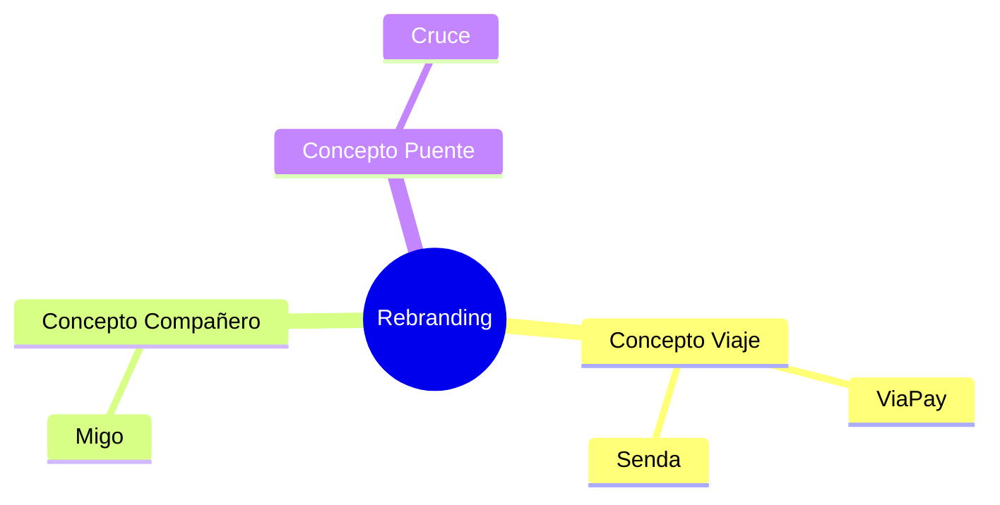

# Análisis de Rebranding: Alternativas de Nombres y Viabilidad de Marca para Spree

El nombre **Spree** presenta desafíos de posicionamiento de marca y propiedad intelectual. Este documento analiza la viabilidad del rebranding, propone alternativas estratégicas orientadas a nuestro público objetivo (turistas y nómadas occidentales) y evalúa la adaptabilidad del logotipo actual.

---

## 1. El Diagnóstico de "Spree"

### Limitaciones Identificadas
1.  **Confusión de Mercado**: "Spree" se asocia fuertemente con *Spree Commerce* (la plataforma de código abierto de e-commerce en Ruby on Rails) y con la expresión inglesa *"shopping spree"* (compras desenfrenadas), lo que diluye el enfoque de billetera financiera segura y compañera de viajes.
2.  **Saturación de Dominios**: El dominio `.com` y las principales extensiones de tecnología (`.io`, `.app`, `.co`) están adquiridas o bajo especulación de precios (Premium).
3.  **Registro de Marca (Trademark)**: Al ser un sustantivo común en inglés, registrar "Spree" para servicios financieros y de transmisión de dinero (Clase 36 de Niza) en EE. UU. y la UE es complejo y costoso debido a la oposición de marcas preexistentes.

---

## 2. Propuestas de Nuevos Nombres (Naming)

Buscamos nombres que sean **fáciles de pronunciar en inglés, español y portugués**, memorables y asociados con el viaje, la facilidad de flujo financiero y el acompañamiento.



### Alternativa 1: Migo / MigoPay
*   **Origen**: Derivado de *"Amigo"*.
*   **Por qué funciona**:
    *   **Pronunciación**: Idéntica y sumamente sencilla en inglés ("Mee-go"), español y portugués.
    *   **Psicología de Marca**: Se posiciona como el "compañero local" del viajero en LATAM, restándole frialdad corporativa a la fintech y generando confianza inmediata.
    *   **Dominios Viables**: `paymigo.com`, `gomigo.travel`, `migo.wallet`.

### Alternativa 2: ViaPay / Via
*   **Origen**: Del latín *"Via"* (camino, ruta, viaje).
*   **Por qué funciona**:
    *   **Asociación Directa**: Universalmente ligado al tránsito y la movilidad.
    *   **Estilo**: Suena a marca financiera premium, sólida y minimalista (estilo iOS).
    *   **Dominios Viables**: `viapay.travel`, `goviapay.com`, `via.wallet`.

### Alternativa 3: Senda / SendaPay
*   **Origen**: *"Senda"* (camino, sendero).
*   **Por qué funciona**:
    *   **Lírica**: Suena elegante y suave al oído del angloparlante ("Sen-dah").
    *   **Concepto**: Representa trazar tu propio camino o ruta en tu viaje de manera ligera (pluma/feather).
    *   **Dominios Viables**: `sendapay.com`, `gosenda.co`, `senda.travel`.

### Alternativa 4: Cruce / CrucePay
*   **Origen**: *"Cruce"* (del verbo cruzar, puente, intersección).
*   **Por qué funciona**:
    *   **Significado**: Expresa a la perfección el puente transfronterizo (cross-border) de divisas y redes que Spree opera por debajo del capó.
    *   **Dominios Viables**: `crucepay.com`, `cruce.travel`, `cruce.app`.

---

## 3. Viabilidad del Logotipo Actual

El logotipo diseñado actualmente para Spree consiste en un **Cubo Negro tridimensional con textura de cuero y tipografía plateada**.

```
    .__________.
   /          / \
  /  STABLE  /   \
 /  FLOW    /     \
.__________.       .
 \          \     /
  \  WALLET  \   /
   \__________\ /
```

### Diagnóstico de Adaptabilidad:
*   **Viabilidad de Cambio**: **Muy Alta**. La figura del **Cubo** es abstracta y representa bloques (blockchain), paquetes/maletas (viajes) y seguridad/estabilidad (stablecoins). 
*   **Recomendación técnica**: Mantener el imagotipo del cubo intacto y únicamente modificar la tipografía plateada integrada para que pase de decir "Spree" a decir el nuevo nombre seleccionado (ej. "Migo" o "ViaPay"). Esto ahorra costos de rediseño de identidad visual y preserva la elegante estética iOS minimalista que se programó en la UI.
