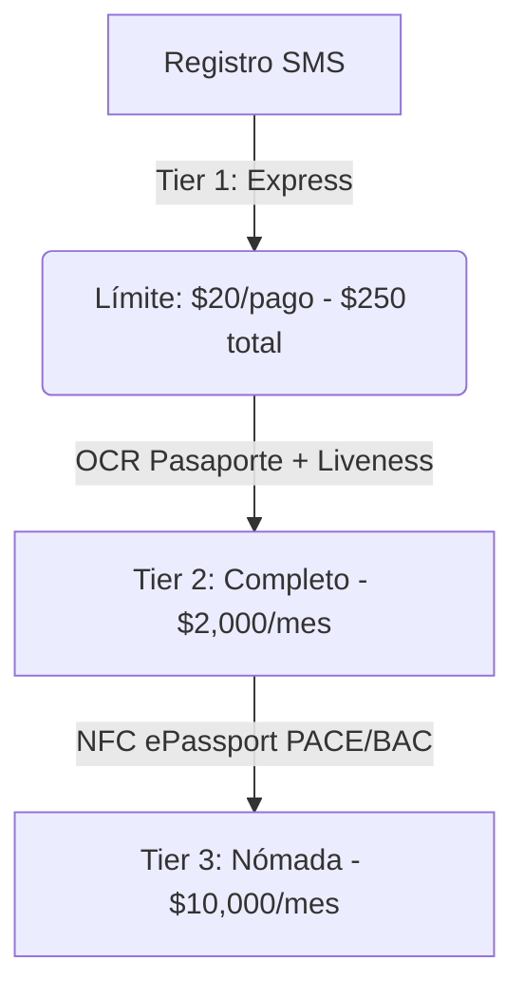

# Evaluación de Lecciones Chinas y Aplicación en Spree (LATAM)

El ecosistema de pagos móviles de China continental, dominado por Alipay (Ant Group) y WeChat Pay (Tencent), ofrece un plano de diseño estratégico y operativo invaluable para **Spree**. Este documento evalúa las sugerencias clave del informe de pagos de China y detalla cómo se han integrado en la arquitectura técnica y financiera de Spree en América Latina.

---

## 1. El Modelo de KYC Progresivo (3 Tiers)

Para resolver la fricción inicial de registro y cumplir simultáneamente con las normativas locales (AML/KYC), Spree adopta una estructura de verificación de identidad escalonada, emulando la flexibilización de límites decretada por el Banco Popular de China (PBOC) en 2024.

### Tabla de Niveles y Límites
| Perfil de Verificación | Requisitos Técnicos | Límite por Transacción | Volumen Mensual |
| :--- | :--- | :--- | :--- |
| **Tier 1: Acceso Express** | Validación de dispositivo + SMS OTP (Teléfono internacional) | **$20 USDc** | **$250 USDc (Total Vitalicio)** |
| **Tier 2: Nivel Completo** | Escaneo OCR del pasaporte (MRZ) + Video Liveness (Sumsub) | **$2,000 USDc** | **$2,000 USDc** |
| **Tier 3: Nivel Nómada** | Lectura criptográfica NFC de chip pasaporte (PACE/BAC) | **$10,000 USDc** | **$10,000 USDc** |

### Lógica de Ejecución en Spree:
*   **Tier 1 (Express):** Permite a los usuarios operar de inmediato al aterrizar (ej. pagar el taxi del aeropuerto) sin fricción de subir documentos.
*   **Tier 2 (Full):** Habilita el acceso a todo el Marketplace (eSIMs, Seguros Chubb, Tours Civitatis, Alquiler de Autos) y eleva el límite a $2,000 USDc/mes.
*   **Tier 3 (Nomad):** Diseñado para nómadas digitales de larga estadía, implementando una lectura de chip NFC (estándar OACI/ICAO 9303) con firmas digitales PACE/BAC soberanas, haciendo que la verificación sea criptográficamente segura e infalsificable contra deepfakes.

---

## 2. Estrategia de Precios Híbrida: Exención en Micropagos (Waiver Rule)

Alipay y WeChat Pay aplican comisiones del 0% para consumos de tarjetas internacionales menores o iguales a 200 RMB (~$28 USD), cobrando un 3% en montos superiores. Esta asimetría tarifaria protege a los comercios pequeños y fomenta el uso diario.

Spree tropicaliza esta estructura para América Latina (Pix en Brasil, Transferencias 3.0/Mercado Pago en Argentina, Bre-B en Colombia) usando **criptoactivos estables (stablecoins)** en su backend de liquidación.

### Regla de Exención (Waiver Rule) en Spree
*   **Transacciones ≤ $15 USDc:** **0% de comisión de servicio**. Spree absorbe los costos de transacción locales (que en sistemas de pago instantáneos como Pix o MODO son casi nulos, ~$0.01).
*   **Transacciones > $15 USDc:** **3% de comisión de servicio**. Esta comisión financia el subsidio a los micropagos cotidianos (loss-leader) y provee el margen de rentabilidad de la plataforma.

### Arbitraje y Economía Unitaria (Unit Economics)
A diferencia de Alipay que debe pagar altas tasas de intercambio transfronterizas (Visa/Mastercard >2.0%), Spree realiza su fondeo de entrada (Inbound) a través de canales de bajo costo como transferencias ACH (EE. UU.) o SEPA (Europa) mediante **Bridge.xyz**, acuñando stablecoins (USDC/EURC) casi gratis. La liquidación hacia rieles locales latinoamericanos (Outbound) se ejecuta a través de off-ramps cripto-a-fiat instantáneos, capturando un margen neto muy superior al procesamiento tradicional de tarjetas de crédito.

---

## 3. Implementación Técnica en el Prototipo

Para validar estos flujos en el prototipo interactivo de Spree, se modificaron los siguientes archivos:

### A. Control de Límites en Checkout (`app.js`)
Si un usuario de **Tier 1 (Express)** intenta realizar una compra de código QR o servicio de mercado superior a **$20 USDc**:
1.  Se bloquea el deslizador de pago (*Slide to Pay*) mostrando el texto `"Excede Límite Express ($20)"`.
2.  El banner verde de ahorro en el checkout se transforma dinámicamente en una alerta roja de **¡Límite de Cuenta Excedido!**, recomendando subir de nivel desde la sección de Perfil.

### B. Widget de KYC en Perfil (`index.html` y `app.js`)
*   Se diseñó una sección de verificación visible en el Perfil de usuario que muestra el nivel de KYC actual (`Tier 1`, `Tier 2`, `Tier 3`) y los límites asociados.
*   Incluye un botón interactivo de **"Subir Nivel"** que lanza el flujo de escaneo óptico (OCR) o lectura NFC dependiendo del estado actual, actualizando y persistiendo la información con el backend Go (`/api/wallet/kyc`).

---

## 4. Comparativa de Modelos: Alipay vs. Spree

| Dimensión | Alipay (Tour Card) | Spree (Stablecoin Wallet) |
| :--- | :--- | :--- |
| **Entidad Emisora / Fiduciaria** | Bank of Shanghai (Cuenta sombra local) | Contratos inteligentes en redes Layer 2 / Solana |
| **Moneda de Fondeo (Inbound)** | Tarjeta Internacional (recargo del 5% fijo) | Transferencia ACH, SEPA o Tarjeta (Bridge.xyz) |
| **Moneda de Pago (Outbound)** | RMB Local (compensación NetsUnion) | Pix (BRL), MP/MODO (ARS), Bre-B (COP) mediante API local |
| **Costos Operativos Backend** | Elevados (tasas de intercambio transfronterizo Visa/MC) | Fracción de centavo (tasas de gas Layer 2 / Solana) |
| **Acceso a Programas de Terceros** | Mini-Programas con Fact + Action (Overlay wx/my) | Marketplace integrado (eSIM, Seguro Chubb, Civitatis, Alquiler de Autos) |
