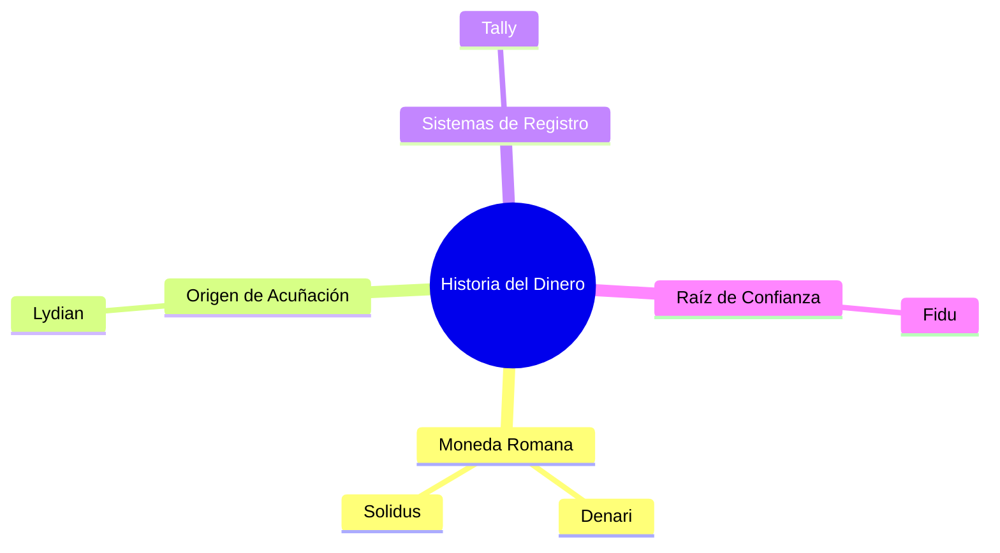

# Propuesta de Rebranding: Nombres Inspirados en la Historia del Dinero e Intercambios

Este análisis profundiza en alternativas de nombres derivadas de la historia evolutiva del dinero, las monedas de la antigüedad y los sistemas históricos de registro de valor. El objetivo es encontrar una marca que proyecte **seguridad institucional, profesionalismo indiscutido y comodidad moderna**, evitando términos genéricos que suenen a "agencia de viajes".

---

## 1. Conceptos Históricos Seleccionados

Investigamos el origen de los medios de cambio clásicos, el origen de la acuñación y las raíces etimológicas de la confianza financiera:

### Candidato A: Denari
*   **El Origen Histórico**: El **Denario** (*denarius*) fue la moneda de plata más famosa y de mayor circulación del Imperio Romano. Es la raíz etimológica directa de la palabra **"dinero"** en español, **"dinheiro"** en portugués, y **"denaro"** en italiano.
*   **Por qué funciona**:
    *   *Profesionalismo*: Es una palabra clásica, con gran peso académico y financiero.
    *   *Comodidad y Familiaridad*: Al sonar similar a "dinero/dinheiro", el usuario de LATAM entiende de inmediato que se trata de una aplicación de fondos, mientras que para el turista angloparlante suena exótico y premium ("Deh-nah-ree").
    *   *Foco*: No tiene ninguna relación con viajes o agencias; es una marca 100% enfocada en finanzas y pagos.

### Candidato B: Solidus (o Soli)
*   **El Origen Histórico**: El **Sólido** (*solidus*) fue una moneda de oro introducida por Constantino el Grande. Fue famosa por mantener su pureza y peso inalterados durante siglos, convirtiéndose en el **primer "stablecoin"** de la historia económica global.
*   **Por qué funciona**:
    *   *Seguridad*: Su significado literal es "sólido", "firme", "seguro". Proyecta una confianza institucional inquebrantable en la custodia de fondos.
    *   *Soli*: Podemos usar la abreviación **"Soli"** como nombre comercial, el cual es corto, amigable, y fonéticamente hace referencia tanto al *Solidus* (seguridad) como al *Sol* (icono del hemisferio sur y LATAM).

### Candidato C: Lydian (Lidia)
*   **El Origen Histórico**: El **Reino de Lidia** (antigua Turquía) es reconocido históricamente como el lugar de nacimiento de las primeras monedas metálicas acuñadas en el mundo (alrededor del 600 a.C.).
*   **Por qué funciona**:
    *   *Significado*: Representa la génesis misma de la transacción moderna y la acuñación.
    *   *Estilo*: Suena elegante, intelectual y muy profesional. Es ideal para una infraestructura que liquida transacciones de manera ágil.

### Candidato D: Fidu (Fiducia)
*   **El Origen Histórico**: Derivado de la palabra latina **"fiducia"** (confianza, lealtad), que es la raíz de la palabra "fiduciario" (dinero basado en la confianza mutua).
*   **Por qué funciona**:
    *   *Seguridad*: Coloca la "confianza" en el centro del nombre.
    *   *Simplicidad*: Es una palabra de dos sílabas, sumamente moderna, jovial y fácil de pronunciar.

---

## 2. Comparativa de Proyección de Marca

| Nombre | Origen Conceptual | Proyección de Seguridad | Proyección de Profesionalidad | Evita Confusión con Agencia |
| :--- | :--- | :--- | :--- | :--- |
| **Denari** | Denario (Plata romana, raíz de "dinero") | **Muy Alta** (Raíz universal del dinero). | **Excelente** (Tradición monetaria). | **Total** (Suena a fintech / neobanco). |
| **Solidus / Soli** | Sólido (Oro romano, estable e inalterado) | **Excelente** (Estabilidad y firmeza). | **Alta** (Clásico e institucional). | **Total** (Foco financiero). |
| **Lydian** | Reino de Lidia (Cuna de la acuñación) | **Alta** (Concepto de origen y legalidad). | **Excelente** (Sofisticado). | **Total** (Foco en infraestructura). |
| **Fidu** | Fiducia (Confianza fiduciaria) | **Excelente** (Significa confianza). | **Media-Alta** (Más moderno/Fintech). | **Total** (Suena a billetera digital). |

---

## 3. Estrategia de Identidad Gráfica

Cualquiera de estos nombres se integra perfectamente con el logotipo del **Cubo Negro tridimensional**:
*   El cubo representa un bloque de una cadena de bloques o una caja fuerte clásica (seguridad).
*   La tipografía plateada integrada (ej. **"Denari"** o **"Soli"**) mantendrá el estilo limpio de iOS y evitará cualquier confusión con "Haush Travel" o agencias de turismo, definiendo el producto claramente como una aplicación de pagos inteligente y moderna para el viajero.
